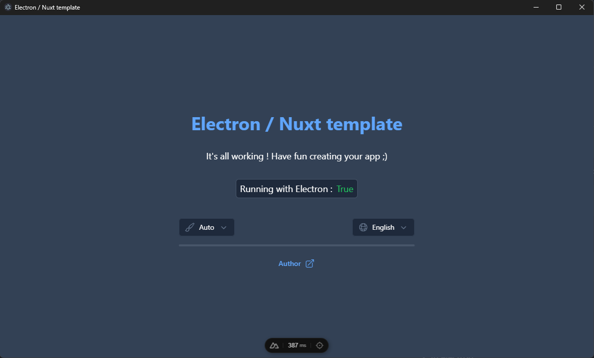

# Electron / Nuxt app template
Template repository for creating Electron apps in typescript with Nuxt.js as the front-end framework.



## Features
This template includes the following features:
- [Nuxt.js](https://nuxt.com/) front-end framework
- [Electron.js](https://www.electronjs.org/) desktop app framework
- [Tailwind CSS](https://tailwindcss.com/) utility-first CSS framework
- [NuxtUI](https://ui.nuxt.com/) component library
- [Pinia](https://pinia.vuejs.org/) for state management
- [Electron Builder](https://www.electron.build/) for building the app

## Requirements
- [Node.js](https://nodejs.org/) v14 or later
- [NPM](https://www.npmjs.com/) v6 or later

## Installation

### 1. Clone the repository

```bash
git clone https://github.com/FurWaz/ElectronNuxt-Template
```

### 2. Install dependencies

```bash
cd ElectronNuxt-Template
npm install
```

## Running the app

### 1. In browser

```bash
npm run dev
```

### 2. In electron

```bash
npm run dev:electron
```

## Building the app

### 1. Nuxt web server 

```bash
npm run build
```

### 2. Static website

```bash
npm run generate
```

### 3. Electron app

```bash
npm run build:electron
```

> [!NOTE] 
> Building on windows requires the terminal session to be run as administrator,
> as described in [this issue](https://github.com/electron-userland/electron-builder/issues/8149).

